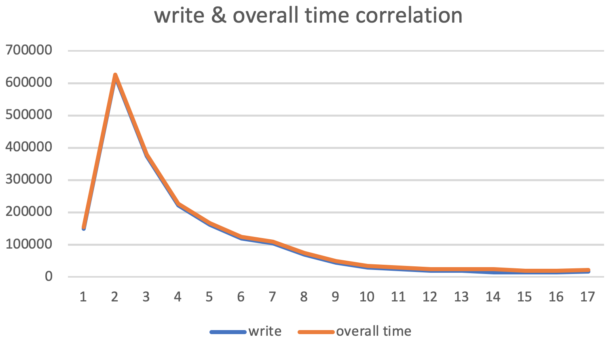
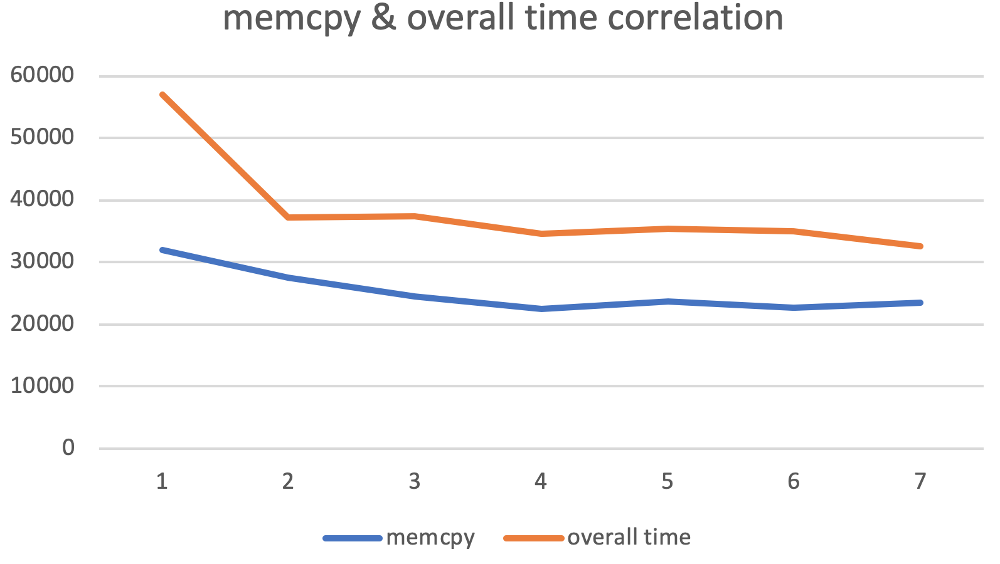
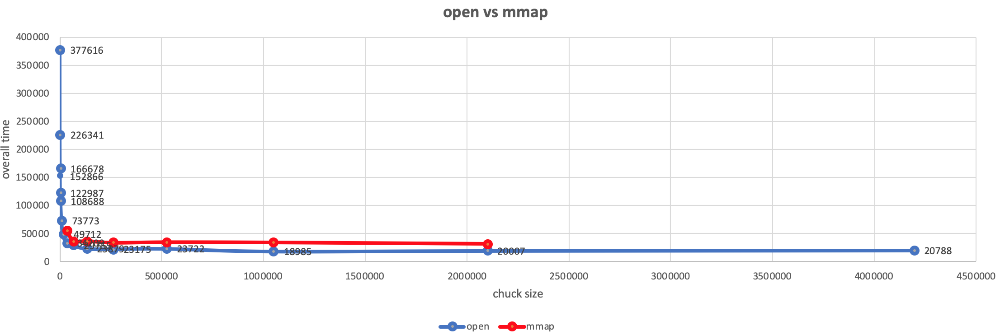
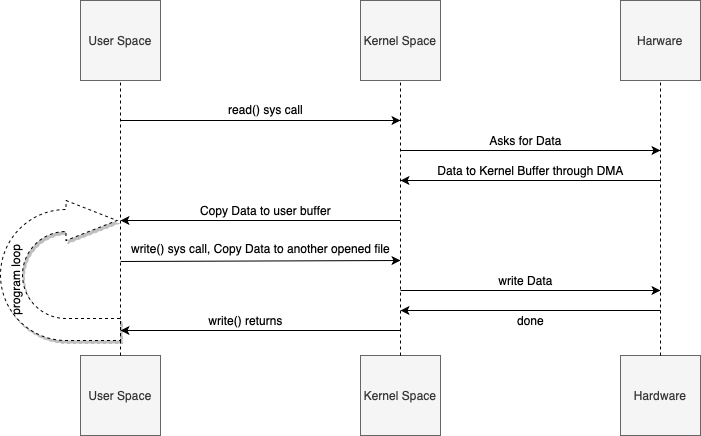
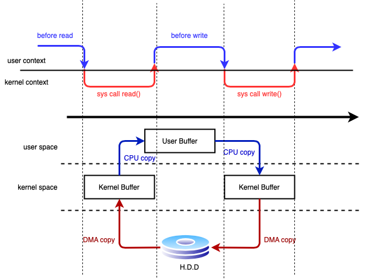
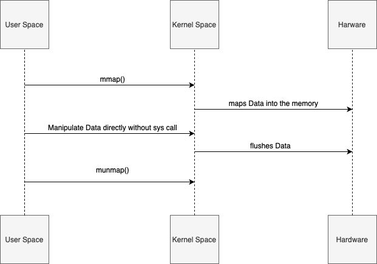

# cp_variant
two variants of a file copy program

## open:
The program operates using a daily open/read/write system calls. I measured elapsed time for each system call and calculate overall elapsed time. The extracted data is as below table:

|Chuck Size| open | write | overall |
|----------|------|-------|---------|
  64    |   53 |  148602 | 152866|
  128   |   69  |620220 | 624496|
  256   |   62  |373219 | 377616|
  512   |   52  | 221955| 226341|
  1024  |   95  | 162260| 166678|
  2048  |   53  | 118529| 122987|
  4096  |   54  | 104302| 108688|
  8192  |   94  | 69275|  73773|
  16384 |   74  | 44933|  49712|
  32768 |   49  | 29641|  34209|
  65536 |   49  | 25324|  29755|
  131072|   63  | 18946|  23879|
  262144|   58  | 18173|  23175|
  524288|   81  | 14188|  23722|
  1048576|  45  | 14612|  18985|
  2097152|  72  | 15279|  20007|
  4194304|  53  | 16091|  20788|

As you may see in the table, there might be a high correlation between write system call and overall elapsed time. So I quantitatively calculated:

**correlation(write, overall) = 0.99**

## mmap:
Data for system calls which are used in mmap program are as below:

|open	| lseek |	mmap	| memcpy |	munmep |	overall |
|---|----|---|---|---|---|
60|	13|	15|	31915|1457|	56940|
50|	12|	18|	27439|1508|37238|
49|	13|	15|	24594|3752|37515|
70|	17|	16|	22565|1431|34492|
47|	11|	14|	23598|1555|35421|
58|	12|	14|	22684|1593|34944|
51|	13|	13|	23444|1639|32533|

According to above table, the amount of overall elapsed time depends on memcpy system call. So after calculating the amount of correlation, we have such output as below:

**correlation(memcpy, overall) = 0.92**

The reason to provide above data is to find out the bottle neck of each program. The overall elapsed time of open program directly relies on write function and chuck size. Each time I doubled chuck size, the overall elapsed time would decrease.

According to below plot, we see that in a large chuck size, the performance of mmap and open programs are approximately the same.

---
Here is what happens when we run open program:

If throughput and latency are bottleneck, this program is annoying. There are **4 context switches** and **2 unnecessary copies** as it is illustrated below:

The top side shows context switches, and the bottom side shows copy operations.

* Step one: the read() system call causes a context switch from user mode to kernel mode. The first copy is performed by the DMA engine, which reads file contents from the disk and stores them into a kernel address space buffer.

* Step two: data is copied from the kernel buffer into the user buffer, and the read() system call returns. The return from the call caused a context switch from kernel back to user mode. Now the data is stored in the user address space buffer, and it can begin its way down again.

* Step three: the write() system call causes a context switch from user mode to kernel mode. A third copy is performed to put the data into a kernel address space buffer again. This time, though, the data is put into a different buffer, a buffer that is associated with another opened file specifically.

* Step four: the write system call returns, creating our fourth context switch. Independently and asynchronously, a fourth copy happens as the DMA engine passes the data from the kernel buffer to disk.

It seems like we can eliminate un-unnecessary copies by means of using mmap() system call. And we expect better performance. Mmap allows code to map file to kernel memory and access that directly as if it were in the application user space, thus avoiding the unnecessary copy. As a tradeoff, that will still involve **4 context switches**. But since OS maps certain chunk of file into memory, you get all benefits from OS virtual memory management.

