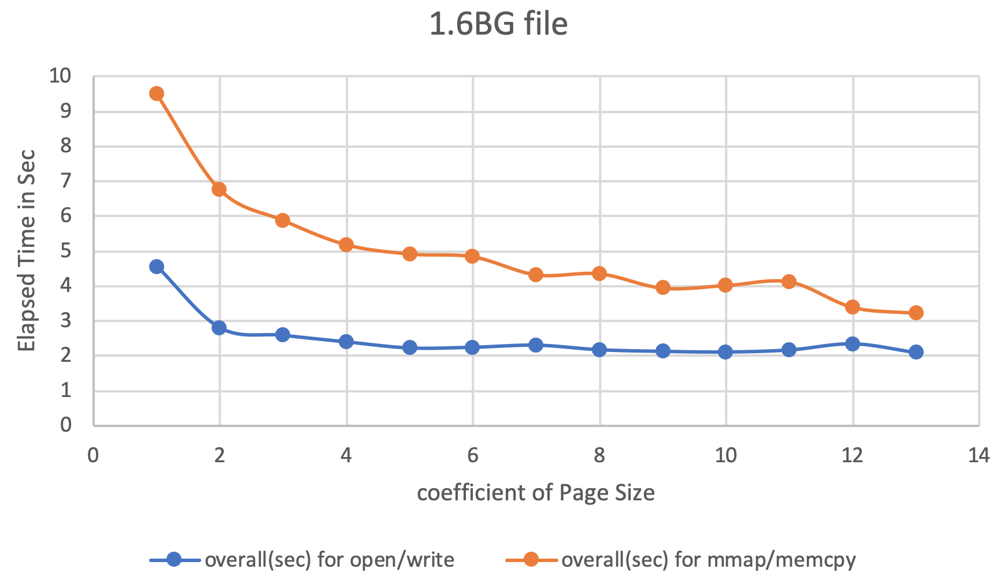

# cp_variant
two variants of a file copy program

The below tables is the overall elapsed time comparison between usual open/write and mmap/memcpy programs. The first table is for transferring 1.6GB of data, and the second one is for transferring 155MB of data.

1.6GB
--------------------------------------------------
|__Chuck Size__| __read/write__ | __mmap/memcpy__|
|:--------:|:----------:|:----------:|
|4096*1 |	4.566 |	9.503 |
|4096*2 |	2.808 |	6.767 |
|4096*4 |	2.592 |	5.889 |
|4096*6 |	2.404 |	5.195 |
|4096*8 |	2.232 |	4.93 |
|4096*10 |	2.251 |	4.849 |
|4096*20 |	2.31 |	4.334 |
|4096*40 |	2.18 |	4.363 |
|4096*80 |	2.135 |	3.953 |
|4096*128 |	2.116 |	4.029 |
|4096*256 |	2.174 |	4.132 |
|4096*512 |	2.348 |	3.404 |
|4096*1024 |	2.099 |	3.235 |

155MB
--------------------------------------------------
|__Chuck Size__| __read/write__ | __mmap/memcpy__|
|:--------:|:----------:|:----------:|
4096*1 |	0.537 |	0.922 |
4096*2 |	0.576 |	0.528 |
4096*4 |	0.267 |	0.562 |
4096*6 |	0.261 |	0.547 |
4096*8 |	0.232 |	0.492 |
4096*10 |	0.221 |	0.447 |
4096*20 |	0.248 |	0.463 |
4096*40 |	0.229 |	0.436 |
4096*80 |	0.236 |	0.423 |
4096*128 |	0.237 |	0.428 |
4096*256 |	0.237 |	0.409 |
4096*512 |	0.196 |	0.4 |
4096*1024 |	0.216 |	0.363 |

---
Here is what happens when we run open program:

If throughput and latency are bottleneck, this program is annoying. There are **4 context switches** and **2 unnecessary copies** as it is illustrated below:

The top side shows context switches, and the bottom side shows copy operations.

* Step one: the read() system call causes a context switch from user mode to kernel mode. The first copy is performed by the DMA engine, which reads file contents from the disk and stores them into a kernel address space buffer.

* Step two: data is copied from the kernel buffer into the user buffer, and the read() system call returns. The return from the call caused a context switch from kernel back to user mode. Now the data is stored in the user address space buffer, and it can begin its way down again.

* Step three: the write() system call causes a context switch from user mode to kernel mode. A third copy is performed to put the data into a kernel address space buffer again. This time, though, the data is put into a different buffer, a buffer that is associated with another opened file specifically.

* Step four: the write system call returns, creating our fourth context switch. Independently and asynchronously, a fourth copy happens as the DMA engine passes the data from the kernel buffer to disk.

It seems like we can eliminate un-unnecessary copies by means of using mmap() system call. And we expect better performance. Mmap allows code to map file to kernel memory and access that directly as if it were in the application user space, thus avoiding the unnecessary copies. As a tradeoff, that will still involve **4 context switches**. But since OS maps certain chunk of file into memory, you get all benefits from OS virtual memory management.

But as a general principle in real life, there is no free lunch! while mmap does avoid that extra copy, it doesn’t guarantee the code will always be faster since it needs to find the space and maintain it in the TLB and make sure to flush it after unmapping and page fault gets much more expensive since kernel now needs to read from the disk to update the memory space and TLB.

* Step one: the mmap() system call causes the file contents to be copied into a kernel buffer by the DMA engine. The buffer is shared then with the user process, without any copy being performed between the kernel and user memory spaces.

* Step two: the memcpy() system call causes the kernel to copy the data from the original kernel buffers into the kernel buffers associated with the other file.

* Step three: the third copy happens as the DMA engine passes the data from the kernel buffer associated with the other file to the disk.
